# 嘿嘿游戏大厅
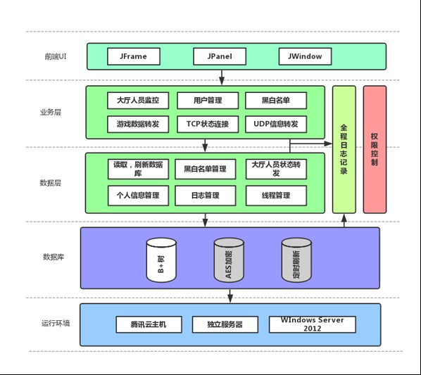
## 上图是服务器的整体架构图，服务器端分为五大部分：服务器的管理，用户信息管理和储存，游戏服务器的实现，大厅信息的更新与转发以及针对用户的线程管理。

# **游戏大厅可完成三人斗地主，双人五子棋对战，大厅内聊天等功能。**

## 一、 服务器的管理

### 首先进入服务器登陆界面，初始的账号和密码分别为admin和123456。文件存储在文件目录下的“log/administrator”，以“admin&123456”进行AES加密后进行base64加密储存。此文件必须保证存在且正确，若文件不存在或被修改，系统将不能登陆。

#### ①	菜单栏
四个选项：
>1.	开启服务器；
>2.	关闭服务器；
>3.	退出，以正常方式退出，在退出时会将内存中的用户数据放入磁盘中；
>4.	强制退出，有风险，可能会未正常保存用户数据，并且使客户端报错，用于紧急情况。
#### ②	在线人员查看
>开启服务器后，客户端可进行连接，连接成功后，会更新表中数据。断开连接功能可单选或多选恶意人员进行强制中断连接。
#### ③	按钮功能
共有五个按钮：
>1.	刷新数据库：可让服务器强制进行一次数据刷新，将磁盘中的用户信息刷新。
>2.	显示/关闭游戏大厅：可打开大厅的监控界面
与客户端不同的是，服务器会广播人员的上线信息，并显示各大厅的在线人数。
>3.	刷新公告：
公告的信息在“log/notice.html”进行修改，每次修改保存后可刷新服务器中的公告，随后改变后来新登陆的人的公告栏信息。
>4.	查询账号信息：可查询某个账号的个人信息。
>5.	显示/关闭监视器：
系统运行的每个步骤都将记录到文档中，可查看系统正在运行中的日志系统，日志系统将保存到“log/activity”中。
>>其中监视器，用来显示系统进行中的操作，以及可以显示用户选择大厅信息，以及状态信息的更新，均会记录到文档中。磁盘中文件日志的储存，以单位日为时间轴进行。因为是实时更新的，可以防止系统因崩溃找不到日志文件，方便管理员进行对服务器的维护以及管理。

### 以上为服务器主框架的大致介绍。
### 服务器的功能还包括有定时刷新数据库，定时刷新重置次数，黑白名单（当客户端进行对客户端的非法操作时加入黑名单，白名单方便管理人员测试管理）等。

## 二、 用户信息管理和储存
###用户的信息储存在一颗B+树上，树的阶数视用户的估计数量而定，在测试中测试用户有十万个，所以采用的是万阶B+树，查找速度均在毫秒之内。B+树的插入与删除速度也均在毫秒之内。B+树的序列化采用将树和树上每一个叶节点通过ObjectOutputStream写入文本文档中。B+树上的每个叶节点有一个键值对存储着每一个Account信息。在找到用户对应的哈希值范围时，再对叶节点的键值对取出用户对象。在未来版本中，可以实现在服务器端修改用户的个人信息，volatile保证树是最新的树，将修改的数据马上刷新到主存。

	在存储用户信息的过程中，对用户的密码、密保问题、密保答案均进行AES加密，加密密钥为“log/aes.key”，只有密钥正确才能在初始化时读取到用户的正确信息。用户的管理和存储包括：
>1. 注册：会修改树的信息，所以采用线程同步锁；每个人注册都会由系统分配一个对应的Id给用户，类似于QQ；
>2. 登陆：在登陆过程中因涉及敏感操作，所以在传输过程中，采用服务器发送公钥给客户端，加密后由服务器解密，防止用户信息的暴露在网络中；
>3. 注销：即设置在线状态为false，关闭连接与线程；
>4. 重置密码（将重置失败次数超过三次的用户禁掉，并每24小时自动刷新重置的次数）；
>5. 修改昵称头像等。

###	在用户使用此客户端时，能捕捉用户的异常输入与操作，并对用户发出信息，如收到的信息格式不符合要求，或者收到非法信息等。登陆成功后，即可进入大厅进行操作。

## 三、 大厅信息的更新
### 大厅信息包括斗地主游戏大厅和五子棋游戏大厅的桌子状态以及更新、大厅聊天信息的更新、大厅公告栏的更新。
>1.	桌子状态的更新采用TCP协议与每个用户建立连接，收取用户的动作状态，如坐下、准备、站起来，存储在对应的容器Vector中，并通过函数对在相同大厅的人进行转发，其他大厅或未选择大厅的用户将无法收取动作信息。每次用户选择大厅点击确认后将会收到全部桌子状态进行刷新。
>>实现此功能的是Gobang_Tables.java和Landlord_Tables.java两个文件。当发送桌子的状态信息失败的时候（即网络阻塞或客户端异常断开时），程序会捕捉异常并及时把异常用户移出列表并关闭用户，防止二次异常。
>2.	大厅聊天信息采用UDP协议接收用户发来的聊天信息，并可以显示在服务器的游戏大厅上并对所有在线的用户在进行转发。
>3.	大厅公告栏通过发送html文本给客户端进行更新，html文件可在“log/notice.html”修改，不再重复叙述。

## 四、 针对用户的线程管理
### 因为对每一个建立了TCP连接的客户，都会分配一个线程进行处理，所以将进行对用户的线程管理。
>首先设置对用户操作时间超时，测试设置了20分钟，当用户超过这个时间没有任何动作时，服务器便会自动断开用户的连接，防止内存过度消耗。
同时，考虑到大用户量，便必然会引发并发问题，所以在服务器中，设置了阻塞队列，当服务器并发处理数量达到一定值，服务器便拒绝接收客户端的登陆，将优先处理前面的客户端。
最后，对用户操作有异常超过两次的，会加入服务器黑名单列表。
----
## **下面是服务器的一些截图**
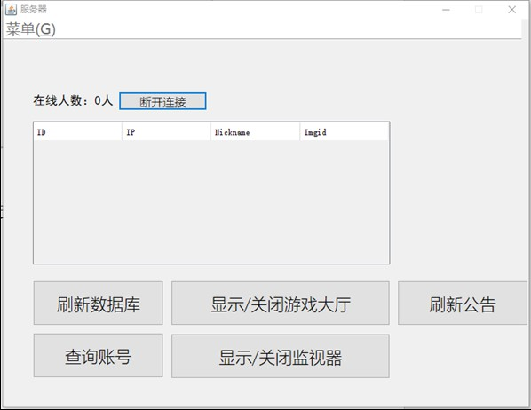
----
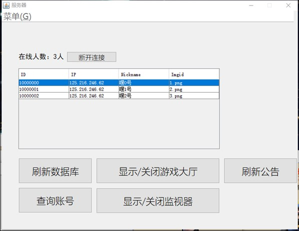
----
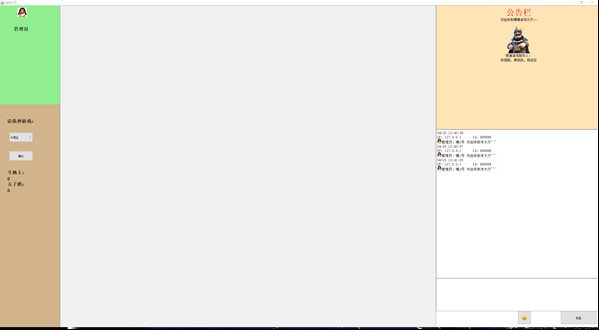
----
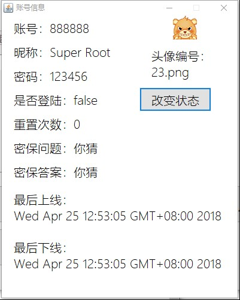
----
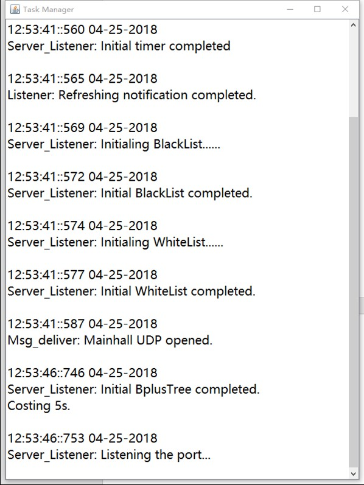
----
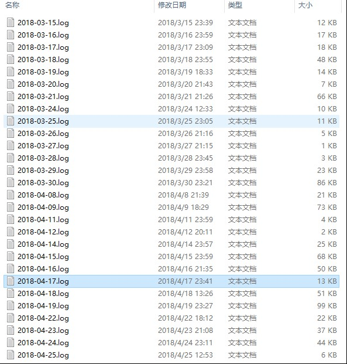
----

## 由于本程序是我与另外两个人完成，我负责写服务器端，所以不再对客户端进行介绍。

## **下面是客户端的一些截图**
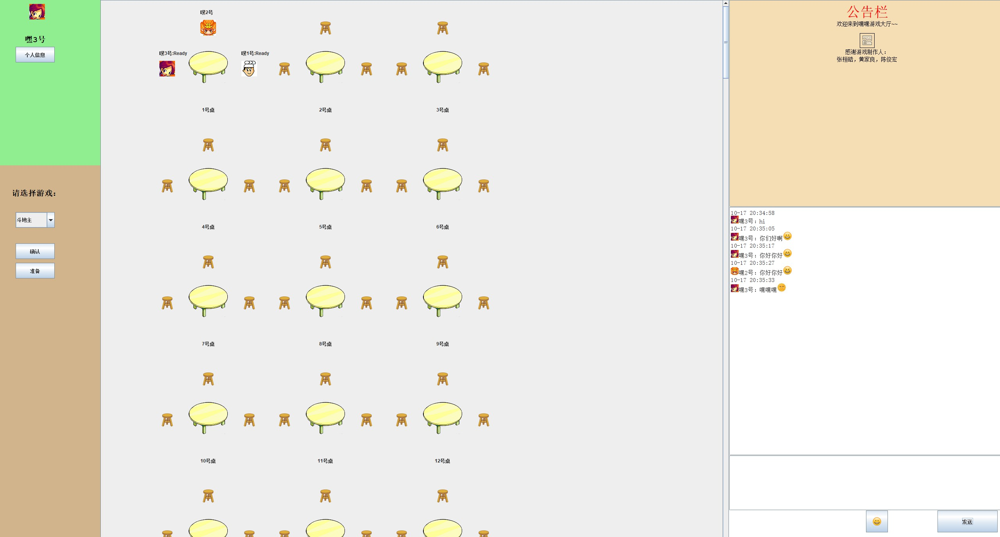
----

----
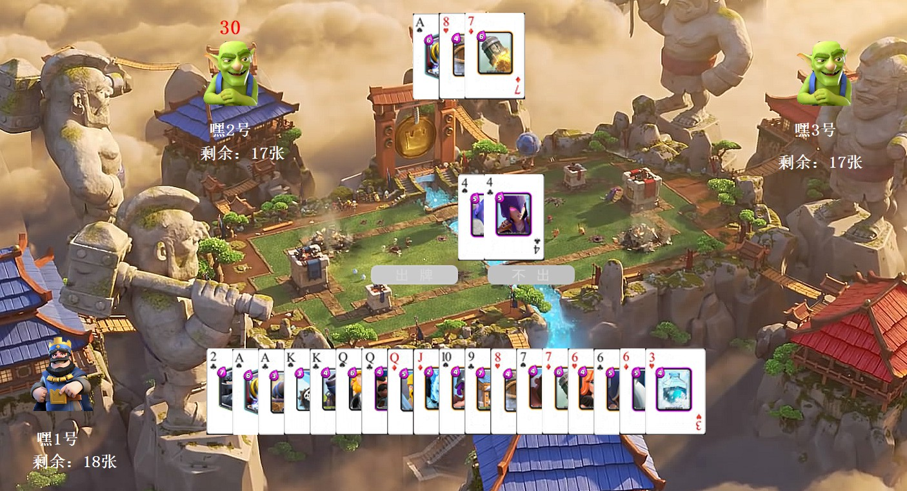
----
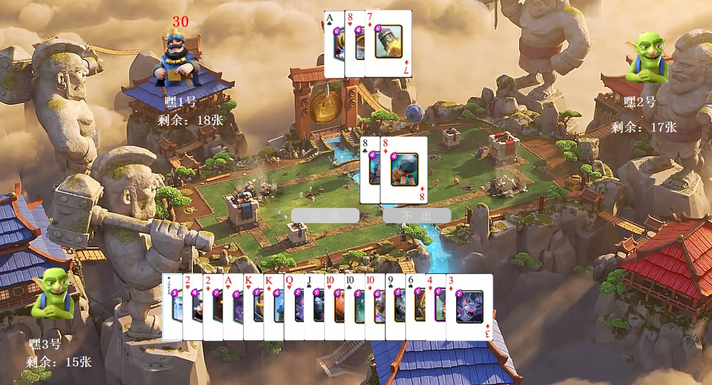
----
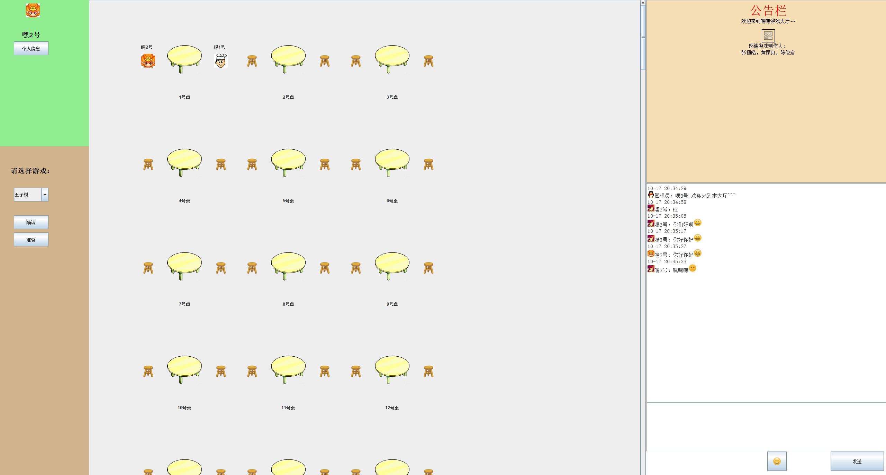
----
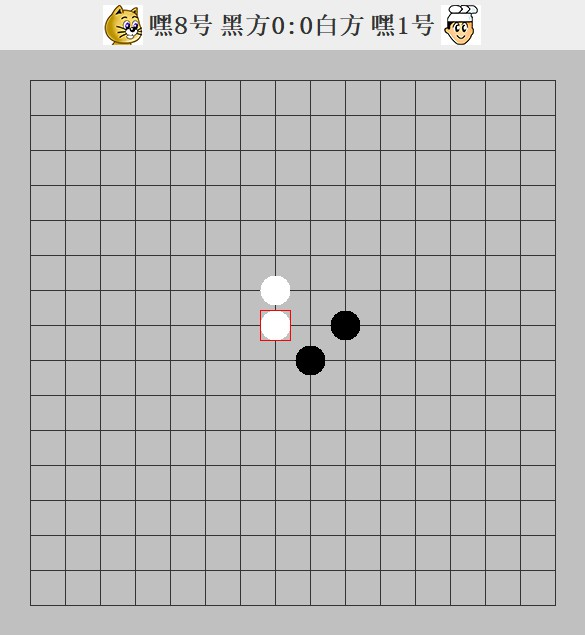
----
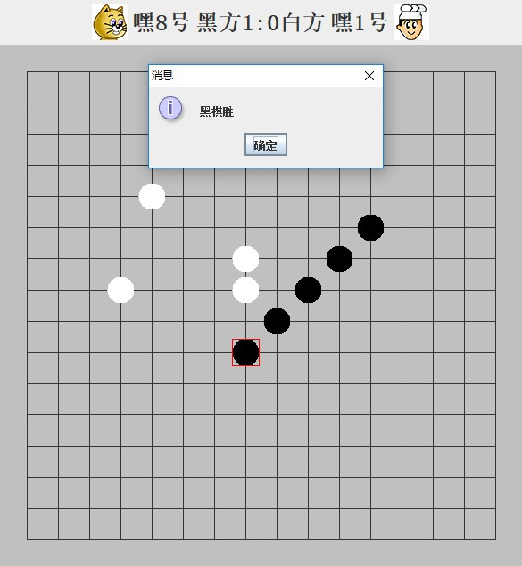
----
